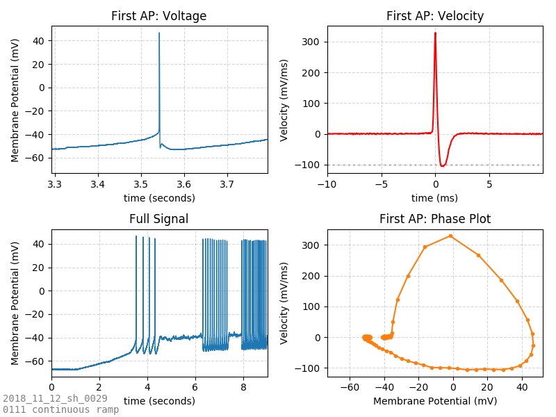
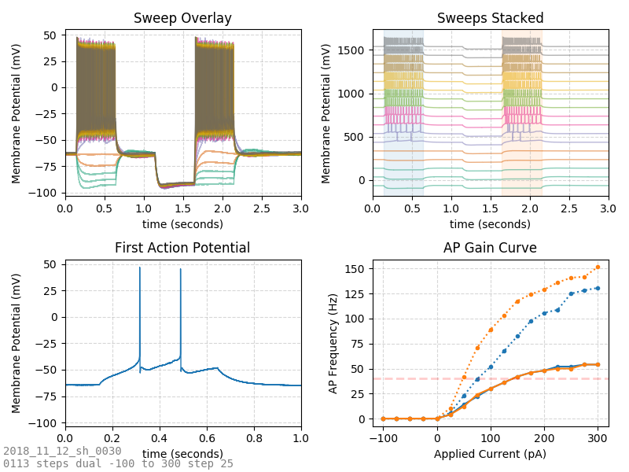
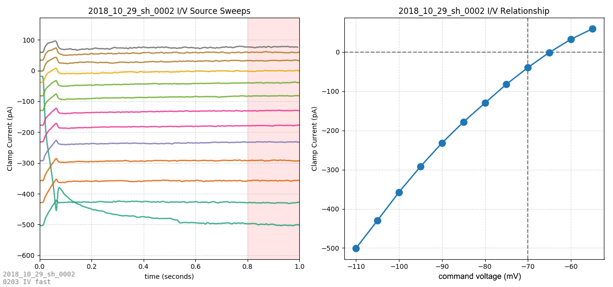
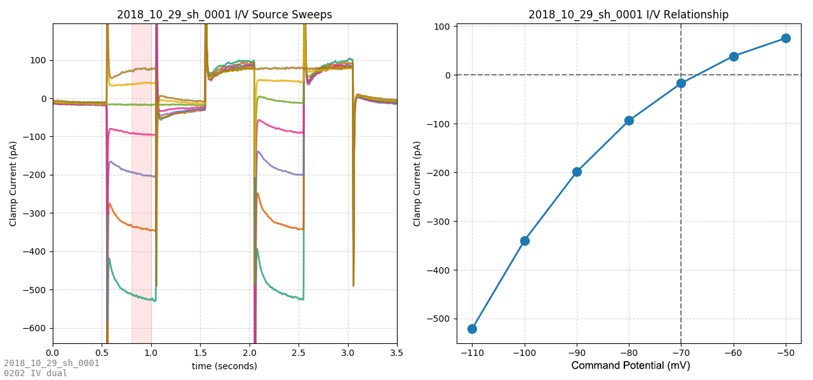
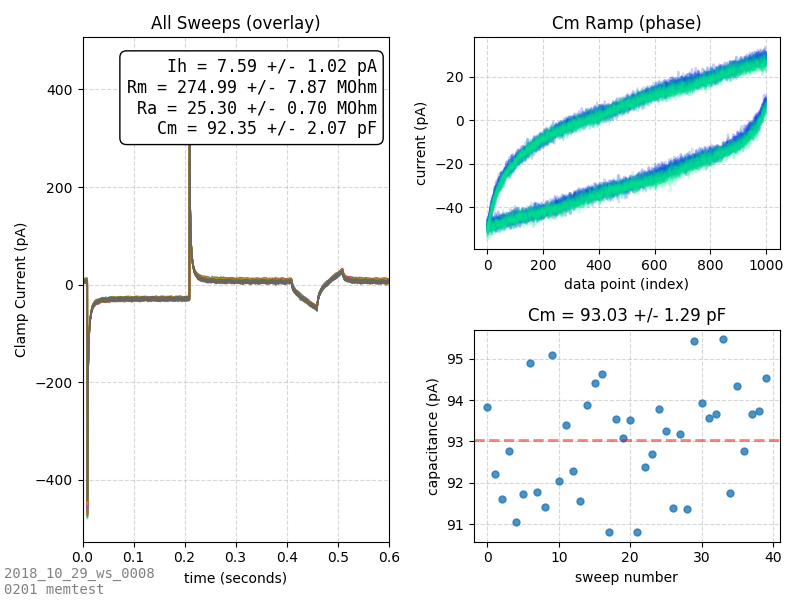
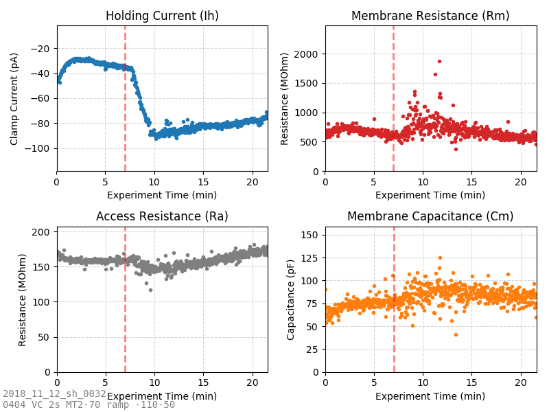
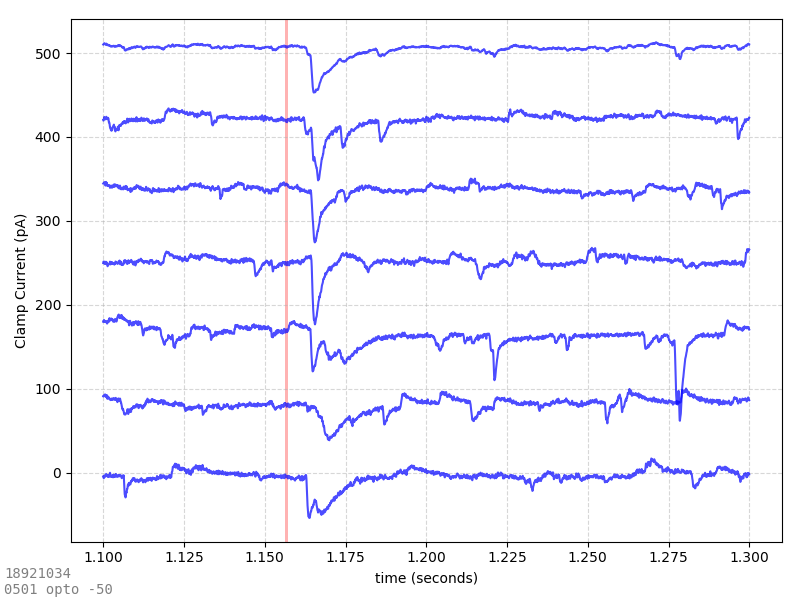
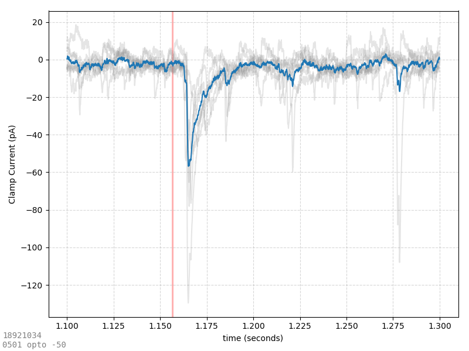
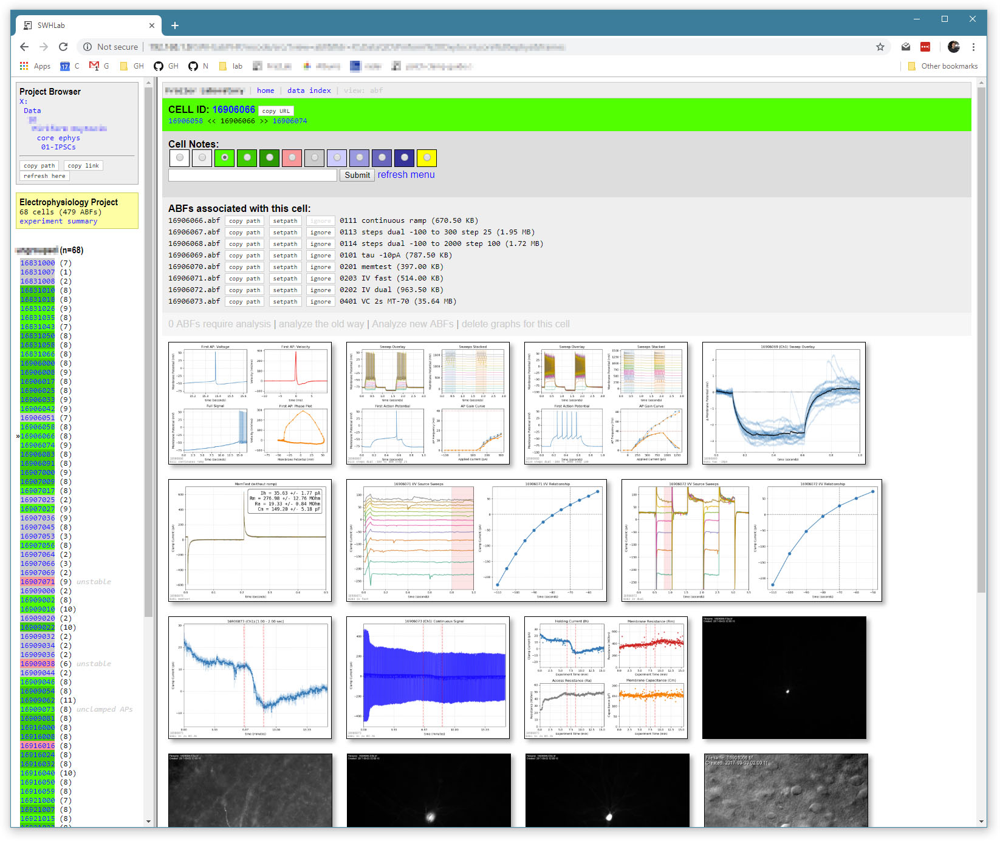

# pyABFauto
**The pyABFauto project seeks to provide an analysis pipeline for ABF files (containing whole-cell patch-clamp electrophysiology data) that requires no human input.** When given a new ABF file is seen (freshly created from a rig) its header and data are read (using [pyABF](https://github.com/swharden/pyABF)), its experiment type is automatically determined (using the protocol as a hint), the appropriate analyses are performed, and several graphs of data are created and saved as PNG files. When combined with a dynamic web interface accessible to the experimenter, this allows the scientist to rapidly assess the outcome of an experiment at rig-time.

**In its current state, pyABFauto should be considered as an example of how [pyABF](https://github.com/swharden/pyABF) can be used to create a rich and highly-automated electrophysiology analysis pipeline**. This project is not one which can be simply downloaded and immediately used for broad applications. While it appears rich in features, they are all highly experimental, and there is not yet a simple way for new users to adopt it. For example, it currently relies heavily on protocol filenames and ABF file comments which can be highly specific to the experiment being performed. 

## Example Output
A few dozen experimental protocols are supported. When an unknown protocol is used, pyABFauto takes a pretty good guess as to how to best analyze it and represent it as a series of images. Below is the output of automated analysis of some of the simplest and most commonly-used ABF protocol types.

### Action Potential Analysis
Automatic analysis of action potential shape and calculation of properties (threshold voltage, rheobase current, half-width, repolarization velocity, etc.) from voltage-clamp ramps. The first AP in response to a ramp is analyzed:

### Action Potential Gain
Action potential detection allows for frequency assessments. Comparison of frequency vs. applied current allows generation of an AP gain plot. Instantaneous frequency of the first pair of APs (dotted lines) vs. steady state frequency (solid lines) allows assessment of accommodation graphically as a function of current injection. Response with and without a hyperpolarizing pulse is shown.

### Current/Voltage Relationship
Current/voltage relationships can be automatically detected by comparison of current (measured from the ADC in voltage clamp) to the command voltage.

This can be done from traces containing current steps (above, useful for visualizing voltage-dependent current transients) or from slow ramps (below, ideal for creating steady stage IV curves).

### Passive Membrane Properties
Analysis of the current transient produced by a voltage-step can yield steady state current (Ih), membrane resistance (Rm), access resistance (Ra), and membrane capacitance (Cm). Code here also calculates capacitance from high-speed voltage-clamp ramps (a technique less sensitive to hardware low-pass filtering, changes in access resistance, and spontaneous currents).

Analysis of membrane test (memtest) properties in every sweep of an experiment where drug is added (vertical red line, automatically added from the time position of comment tags in the ABF file) allows analysis of how that drug affected channels in the membrane...

### Optogenetics and Evoked Currents
Rapid assessment of evoked currents is facilitated by visual inspection. Sweep-by-sweep evoked synaptic current fidelity is visualized by stacked sweeps:

The magnitude of evoked currents (and the post-stimulus delay) is visible when averaging all sweeps together. Note that the position of the optogenetic stimulus (red line) is taken from the digital output signal stored in the ABF file. If a longer optogenetic stimulation is used, the shaded area becomes wider automatically. 

## Web Interface

Files created by pyABFauto are displayed as a web interface using [SWHLabPHP](https://github.com/swharden/SWHLabPHP). This allows easy integration of images (TIFs acquired at rig-time, automamtically brightness/contrast-enhanced and displayed as JPG for web viewing), e-phys data (analyzed with pyABF/pyABFauto), and cell grouping (ABFs grouped by cell is a feature provided entirely by the web interface, including color-coding of cells, and addition of comments to cells).

