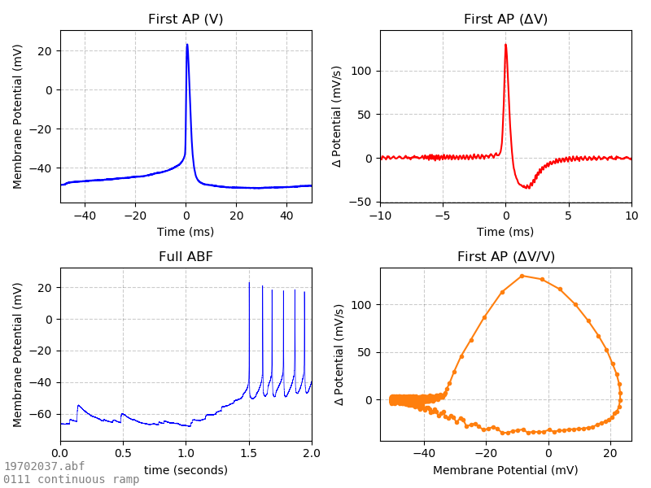

# pyABFauto
**The pyABFauto project provides an analysis pipeline for ABF files that requires no human input.** 

pyABFauto's _watcher_ module repeatedly scans analysis folders and automatically analyzes new ABFs when they appear (ideal for multi-user network drives). ABFs are read using [pyABF](https://github.com/swharden/pyABF), analyzed with [numpy](https://numpy.org/), and graphed with [matplotlib](https://matplotlib.org/).

When pyABFauto is combined with a dynamic web interface (such as [FlaskABF](https://github.com/swharden/FlaskABF)) and made accessible to the experimenter, the scientist can rapidly assess neuron properties and the outcome of experiments in real time.

## Usage

Uses are highly customized to the individual and experiment. Common analyses are available in [pyABFauto/analyses](src/pyABFauto/analyses) and are called by [protocols.py](src/pyABFauto/protocols.py) depending on information found in the ABF header (such as clamp-mode, experiment length, and whether or nor tag comments are present).

Description | Analysis Output
---|---
Repeated voltage-clamp steps reveal information like membrane resistance and whole-cell capacitance | 
Action potential properties can be determined from current-clamp ramps | 
Action potential gain curves can be created from current-clamp steps | 
Voltage-clamp steps reveal current/voltage relationships and voltage-dependent tail currents | 
Evoked currents can be monitored over time | 


## Project Status

This project is currently under development and is not intended to be used by the public. It is made public for reference and as an example application using the latest versions of [pyABF](https://github.com/swharden/pyABF).

An earlier version of byABFauto can be found [here](/dev/pyABFauto-v1).

## Development Environment

```
python -m venv env
```

```
env\Scripts\activate
```

```
python.exe -m pip install --upgrade pip
```

```
pip install -r requirements.txt
```