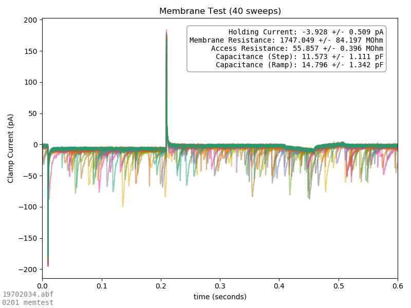
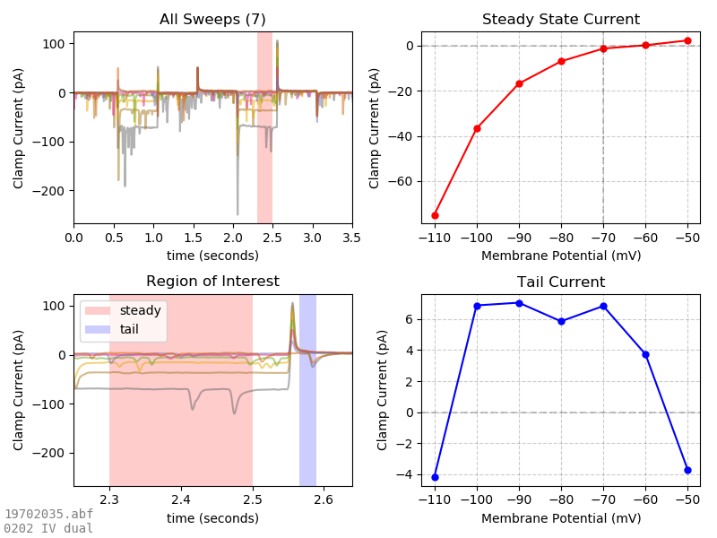
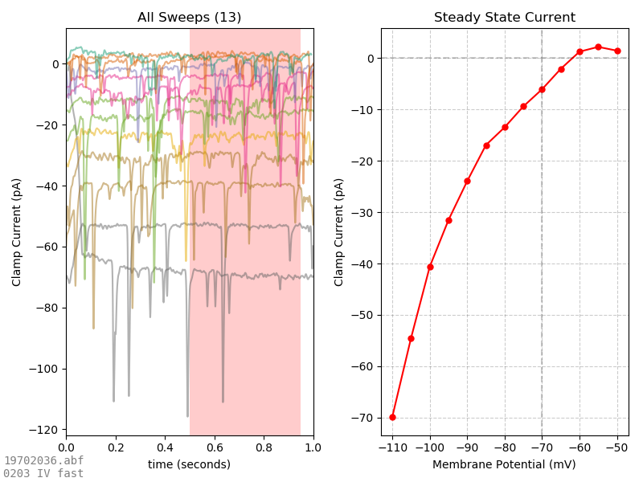
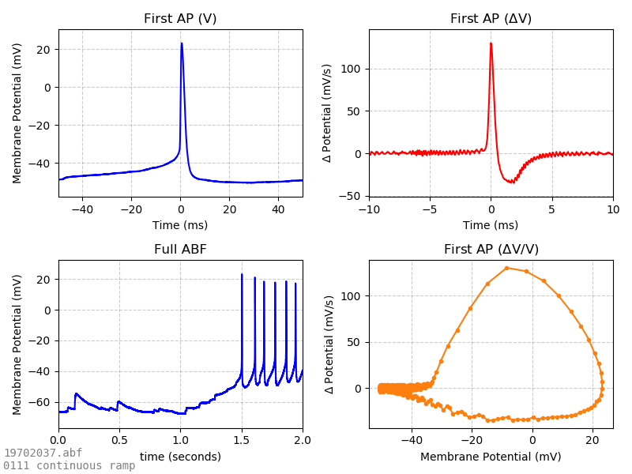
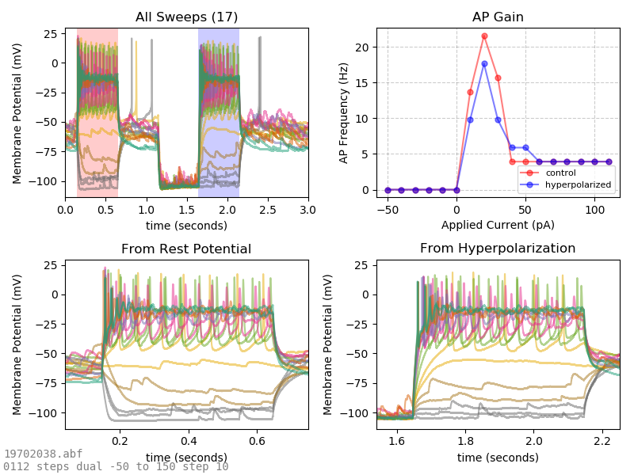
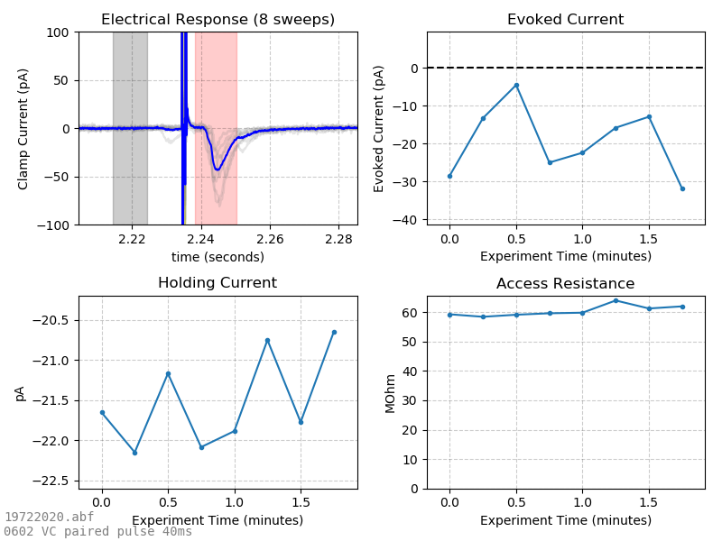
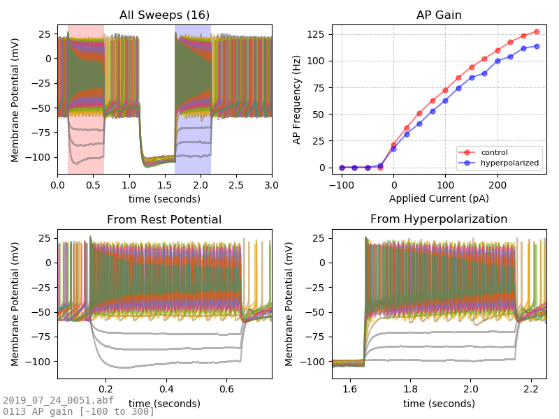

# Auto-Analysis Output

_This page was generated by [analyzeDataFolder.py](../analyzeDataFolder.py) on 2019-07-25 at 09:57:18_

### 19702034_autoanalysis.png

### 19702035_autoanalysis.png

### 19702036_autoanalysis.png

### 19702037_autoanalysis.png

### 19702038_autoanalysis.png

### 19722020_autoanalysis.png

### 2019_07_24_0051_autoanalysis.png

